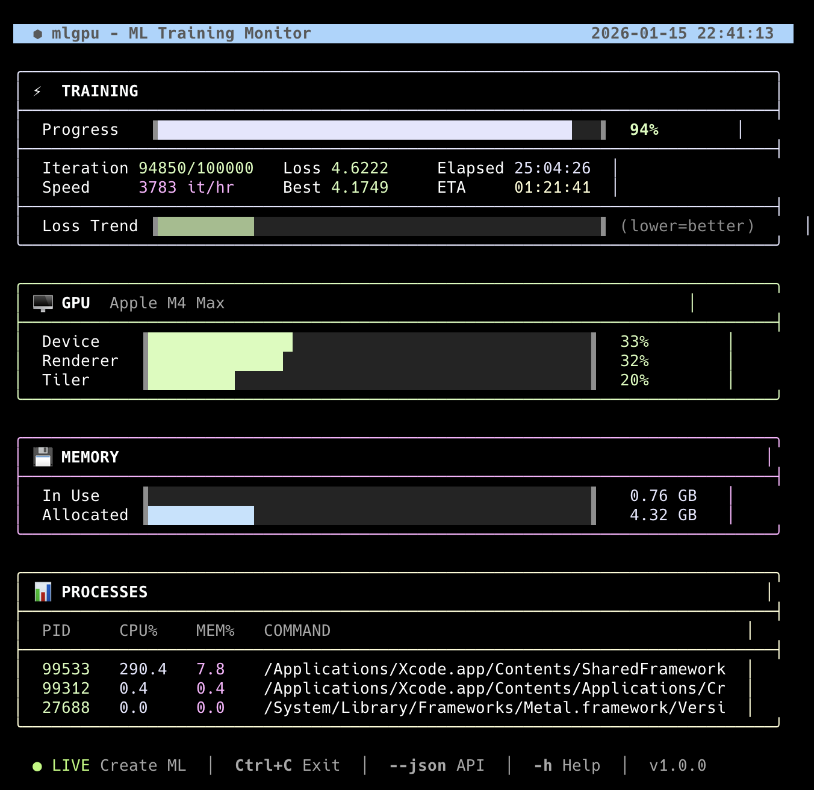

# mlgpu

**Apple Silicon GPU Monitor for ML Training**

A lightweight, htop-style CLI tool that monitors GPU utilization and ML training progress on Apple Silicon Macs. Unlike general-purpose monitors, mlgpu is specifically designed for machine learning workflows.



## Features

- **Live Training Metrics** - Automatically reads iteration/loss from training frameworks
- **GPU Monitoring** - Device, Renderer, and Tiler utilization
- **Memory Tracking** - GPU memory in-use and allocated
- **ML Process Detection** - Shows active training processes
- **No Sudo Required** - Uses public macOS APIs
- **JSON API** - Scriptable output for automation
- **Multiple Framework Support**:
  - Apple Create ML (auto-detection)
  - PyTorch / Ultralytics YOLO
  - HuggingFace Transformers

## Installation

### Quick Install (Recommended)

```bash
curl -fsSL https://raw.githubusercontent.com/artifactiq/mlgpu/main/install.sh | bash
```

### Manual Install

```bash
git clone https://github.com/artifactiq/mlgpu.git
cd mlgpu
chmod +x mlgpu
sudo ln -s $(pwd)/mlgpu /usr/local/bin/mlgpu
```

### Homebrew (Coming Soon)

```bash
brew install artifactiq/tap/mlgpu
```

## Usage

```bash
# Basic usage - auto-detects training framework
mlgpu

# Monitor PyTorch training
mlgpu -l ./runs/train.log -i 50000

# Monitor HuggingFace Trainer
mlgpu --hf ./output/

# Specify Create ML project
mlgpu -p ~/Projects/MyModel.mlproj

# Get JSON output for scripting
mlgpu --json

# Single snapshot (no refresh)
mlgpu --once

# Reset timer for new training run
mlgpu --reset
```

## Supported Frameworks

| Framework | Detection Method | Auto-Detect |
|-----------|------------------|-------------|
| Apple Create ML | Project file monitoring | ✅ Yes |
| PyTorch | Log file parsing | Via `-l` flag |
| Ultralytics YOLO | Log file parsing | Via `-l` flag |
| HuggingFace Trainer | trainer_state.json | Via `--hf` flag |
| Manual | State file | Fallback |

### Create ML Integration

mlgpu automatically finds Create ML projects in `~/src`, `~/Projects`, or `~/Documents` and reads live training metrics from the project's Model Container JSON file, which is updated every 10 iterations.

### PyTorch Integration

Point mlgpu to your training log file:

```bash
# Training script writes to train.log
python train.py 2>&1 | tee train.log &

# Monitor in another terminal
mlgpu -l train.log -i 100000
```

Supported log formats:
- `Epoch 5/100, Loss: 0.234`
- `Step 1000, loss=0.234`
- `iteration: 1000, loss: 0.234`

### HuggingFace Integration

```bash
# HuggingFace Trainer saves to output_dir
trainer.train()

# Monitor the output directory
mlgpu --hf ./output/
```

### Manual Mode

If no framework is detected, you can manually update progress:

```bash
echo "5000|0.234" > /tmp/mlgpu_state
```

Format: `iteration|loss`

## JSON API

Get structured output for scripts and dashboards:

```bash
mlgpu --json
```

Output:
```json
{
  "version": "1.0.0",
  "timestamp": "2026-01-14T21:30:00Z",
  "data_source": "createml",
  "training": {
    "iteration": 5000,
    "total": 100000,
    "progress_pct": 5,
    "loss": 7.234,
    "best_loss": 7.1,
    "speed_iter_hr": 18000,
    "elapsed_sec": 1000,
    "eta_sec": 19000
  },
  "gpu": {
    "name": "Apple M4 Max",
    "device_util": 45,
    "renderer_util": 42,
    "tiler_util": 20
  },
  "memory": {
    "used_bytes": 1073741824,
    "allocated_bytes": 4294967296,
    "used_gb": 1.00,
    "allocated_gb": 4.00
  }
}
```

Use with jq:
```bash
# Get current loss
mlgpu --json | jq '.training.loss'

# Check if GPU is being utilized
mlgpu --json | jq '.gpu.device_util > 10'

# Monitor in a loop
watch -n 5 'mlgpu --json | jq ".training"'
```

## Display Sections

### Training Progress
- **Progress Bar** - Visual completion percentage
- **Iteration** - Current/Total with live updates
- **Loss** - Color-coded (green < 5, yellow 5-10, red > 10)
- **Speed** - Iterations per hour
- **ETA** - Estimated time remaining
- **Best Loss** - Lowest loss achieved

### GPU Utilization
- **Device** - Overall GPU usage
- **Renderer** - Graphics rendering load
- **Tiler** - Tile-based rendering load

Thresholds: 🟢 < 50% → 🟡 50-80% → 🔴 > 80%

### Memory
- **In Use** - Active GPU memory
- **Allocated** - Reserved GPU memory

### Processes
Top ML-related processes by CPU usage.

## Requirements

- macOS with Apple Silicon (M1/M2/M3/M4)
- Bash 4+
- Python 3 (for Create ML/HuggingFace parsing)

## Comparison with Other Tools

| Feature | mlgpu | asitop | mactop | macmon |
|---------|-------|--------|--------|--------|
| ML Training Progress | ✅ | ❌ | ❌ | ❌ |
| Framework Integration | ✅ | ❌ | ❌ | ❌ |
| GPU Utilization | ✅ | ✅ | ✅ | ✅ |
| No Sudo Required | ✅ | ❌ | ✅ | ✅ |
| JSON API | ✅ | ❌ | ✅ | ✅ |
| ETA Calculation | ✅ | ❌ | ❌ | ❌ |
| Loss Tracking | ✅ | ❌ | ❌ | ❌ |

## Troubleshooting

### "No ML processes detected"
Training process may use different names. Check running processes:
```bash
ps aux | grep -i python
```

### Training metrics stuck at 0
- Verify your log file path: `mlgpu -l /correct/path/to/train.log`
- Check Create ML project path: `mlgpu -p ~/Projects/MyModel.mlproj`
- Ensure training is actively running (not paused)

### GPU utilization shows 0%
- Verify Apple Silicon Mac (Intel Macs not supported)
- Check ioreg works: `ioreg -l | grep "Device Utilization"`

## Contributing

Contributions welcome! Please see [CONTRIBUTING.md](CONTRIBUTING.md) for guidelines.

### Ideas for Contributions
- [ ] TensorBoard log parsing
- [ ] Weights & Biases integration
- [ ] Historical charts / sparklines
- [ ] Slack/Discord notifications
- [ ] Web UI dashboard mode

## License

MIT License - see [LICENSE](LICENSE)

## Credits

Built by [Artifactiq](https://artifactiq.ai) while training object detection models on Apple Silicon.

Inspired by:
- [asitop](https://github.com/tlkh/asitop)
- [mactop](https://github.com/metaspartan/mactop)
- [macmon](https://github.com/vladkens/macmon)

---

**Star ⭐ this repo if you find it useful!**
